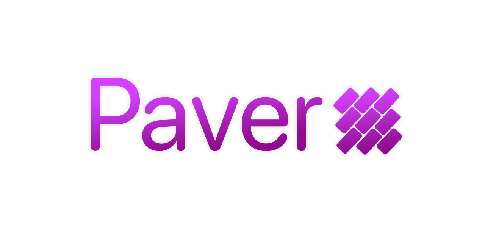

<p align="center">
 
</p>


# Support 
[ ](https://twitter.com/wvabrinskas)
[](https://discord.gg/p84DYph4PW)
[](https://williamvabrinskas.com)

# Introduction
Paver is a super lightweight UIView layout utility. It's effectively an extension on UIView allowing for quick constraint assignment to any view. It reduces the complexity of using the built-in AutoLayout by wrapping a lot of the verbose assignments to easy to read functions and variables.

# Usage

Create a UIView conforming view and add it to some parent view you want to have `AutoLayout` apply to. 
```
let button = UIButton(frame: .zero)
let button2 = UIButton(frame: .zero)

view.addSubview(button)
view.addSubview(button2)
```
Once the views are created you can simply call `apply()` on the new views to set the constraints: 

```
button.apply {[
    button.size.height.constant(50),
    button.size.width.constant(100),
    button.center.x.to(view),
    button.center.y.to(view)
]}

button2.apply {[
    button2.size.height.constant(50),
    button2.size.width.constant(100),
    button2.center.x.to(view),
    button2.aligment.top.to(button, constant: 50)
]}
```

`apply` is a function extension on UIView
`func apply(_ constraints: () -> [NSLayoutConstraint?]) {` that takes in a block that expects an array of `NSLayoutConstraint` as a return value. 

Calling `apply` will automatically take care of the layout for you. That's it! 

## UIView Convienence Functions
`setSizeEqual(to view: UIView)` 
- Sets the caller's size equal to the passed in view

`setSizeEqual(to size: CGSize)`
- Set the caller's size equal to the passing size. 

`center(in view: UIView, size: CGSize)`
- Set the caller's position to the center of the passed in view while also setting the size of the caller.

### Constraints functions
Functions that are useful in the `apply` block. 

`to(_ view: UIView, constant: CGFloat = 0) -> NSLayoutConstraint`
- Sets a `UIView.AnchorProduct` equal to the passed in views equivalent `AnchorPoint` with a constant adjustment.

`lessThanOrEqualTo(_ view: UIView, constant: CGFloat = 0) -> NSLayoutConstraint`
- Sets a `UIView.AnchorProduct` lessThanOrEqualTo the passed in views equivalent `AnchorPoint` with a constant adjustment.

`greaterThanOrEqualTo(_ view: UIView, constant: CGFloat = 0) -> NSLayoutConstraint`
- Sets a `UIView.AnchorProduct` greaterThanOrEqualTo the passed in views equivalent `AnchorPoint` with a constant adjustment.
